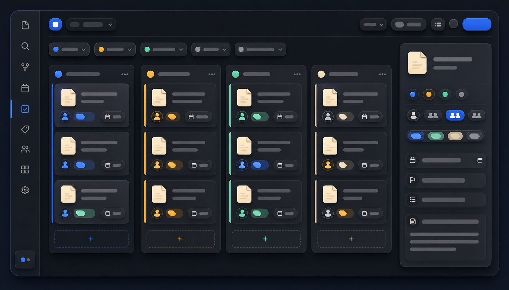

# Task Cockpit

Task Cockpit is an interactive dashboard for editing Markdown checkbox tasks from one Obsidian view. It keeps task metadata in the task line itself, so the dashboard stays linked to source notes instead of creating a separate task database.

> The image is an illustrative example of the workflow, not a screenshot of the plugin.

## Features

- Mark tasks complete or reopen them.
- Edit task text, priority, assignee, project, product, and due date.
- Group by project, product, project + product, person, priority, or due date.
- Sort by priority, due date, project, product, person, or text.
- Filter by person, due date, search text, and file history window.
- Show only grouped items or only ungrouped items.
- Open the source note at the task line.
- Expand and collapse all groups or individual groups.

## Expected task format

~~~md
- [ ] Follow up on measurement plan [[Example Person]] [[Example Project]] [[Example Product]] [due:: 2026-05-22]
~~~

The plugin uses configured folders to resolve people, projects, and products. It does not migrate task data into a separate database.

## Install

1. Copy this folder to <vault>/.obsidian/plugins/task-cockpit/.
2. Ensure manifest.json, main.js, and styles.css are present.
3. Enable **Task Cockpit** under Settings → Community plugins.
4. Click the ribbon icon or run **Open Task Cockpit** from Command Palette.

This distribution includes a prebuilt main.js; no npm build is required.

## Settings

Defaults are tuned for a vault with:

- People folder: People
- Projects root: Projects
- Products root: Products
- Cutoff days: 90
- Me name: Your Name

You can change people folders, project/product roots, ignored folders, cutoff days, assignee behavior, and your display name in Settings → Task Cockpit.

## Limitations

- Only task lines recognized by the parser appear.
- Editing writes directly to the source Markdown file.
- Values depend on your folder structure and wiki-link conventions.
- The dashboard may need updates as Obsidian's APIs evolve.

## License

MIT. See [LICENSE](LICENSE).
